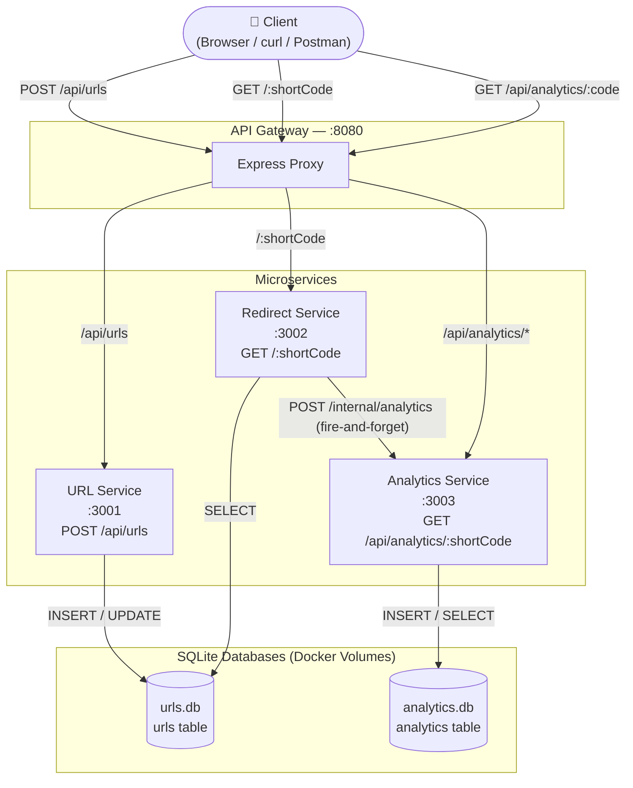

# Architecture Diagram

## Request Flow

| Action | Path |
|---|---|
| Shorten URL | Client → Gateway → URL Service → urls.db |
| Redirect | Client → Gateway → Redirect Service → urls.db → (notify) Analytics Service → analytics.db |
| Get Analytics | Client → Gateway → Analytics Service → analytics.db |
